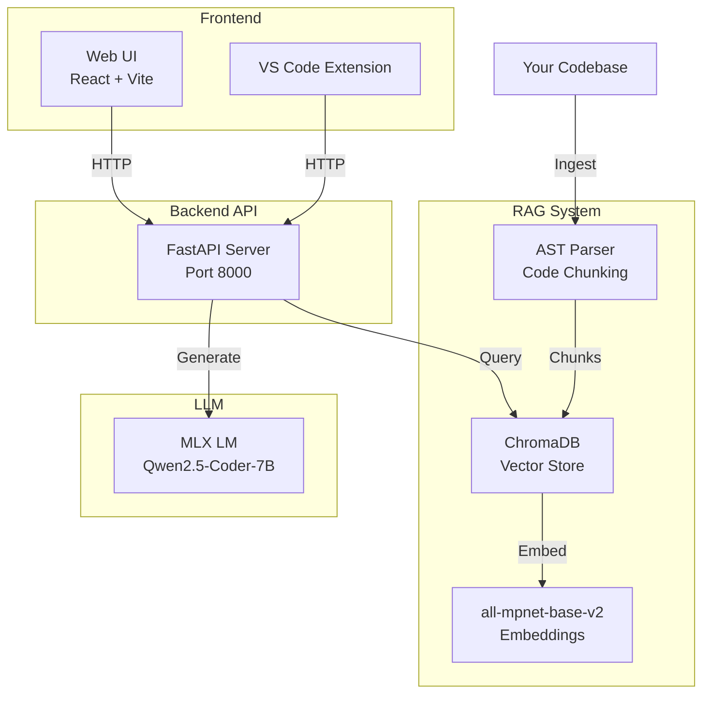

# Flair Assistant 🎰✨

**An AI-powered codebase assistant with RAG (Retrieval-Augmented Generation) for slot game development.**

Flair Assistant helps developers understand and work with slot game codebases by providing contextually accurate answers based on the indexed codebase. Works on **macOS, Windows, and Linux** with local LLM inference.


## ✨ Key Features

- **🔍 RAG-Powered Code Understanding**: AST-aware code chunking with vector similarity search
- **⚡ Local LLM Inference**: Cross-platform support (MLX on Mac, Ollama on Windows/Linux)
- **🎯 Context-Specific Answers**: Retrieves and cites actual code from your indexed codebase
- **🌐 Modern Web UI**: React-based interface with dual modes (General & Flair)
- **🧩 VS Code Extension**: Integrated chat sidebar for in-editor assistance
- **📊 Source Transparency**: Shows which code files were used to generate each answer

## 🏗️ Architecture



## 🚀 Quick Start

### Prerequisites

**macOS** (M1/M2/M3):
- **Python 3.9+**
- **Node.js 18+** (for web UI)

**Windows/Linux**:
- **Python 3.9+**  
- **Node.js 18+**
- **Ollama** (LLM runtime) - [Installation guide](docs/WINDOWS_SETUP.md)

> **Note for Windows users**: See [Windows Setup Guide](docs/WINDOWS_SETUP.md) for complete instructions.

### Installation

1. **Clone the repository**:
   ```bash
   git clone <repository-url>
   cd AI-assistant
   ```

2. **Install Python dependencies**:
   ```bash
   python3 -m venv .venv
   source .venv/bin/activate
   pip install -e .
   ```

3. **Configure environment**:
   ```bash
   cp .env.example .env
   # Edit .env to set CODEBASE_PATH to your project
   ```

4. **Index your codebase**:
   ```bash
   slot-assistant ingest --force
   ```
   This will:
   - Parse TypeScript/JavaScript files using AST
   - Generate embeddings with `all-mpnet-base-v2`
   - Store in ChromaDB vector database

5. **Start the API server**:
   ```bash
   slot-assistant serve
   ```
   Server runs on `http://localhost:8000`

6. **Start the Web UI** (in a new terminal):
   ```bash
   cd web-ui
   npm install
   npm run dev
   ```
   UI available at `http://localhost:5173`

## 💡 Usage

### Web UI

1. Open http://localhost:5173
2. Toggle between modes:
   - **💡 General**: Generic programming questions
   - **⚡ Flair**: Codebase-specific queries with RAG

3. Ask questions like:
   ```
   How does the ReelsView class work?
   Explain the GamePlayIntro implementation
   What's the purpose of the SlotMachine class?
   ```

4. View retrieved sources to verify accuracy

### CLI

```bash
# Ask a question via CLI
slot-assistant ask "How does symbol animation work?"

# Re-index after code changes
slot-assistant ingest --force

# Check RAG status
curl http://localhost:8000/rag/status
```

## 📁 Project Structure

```
AI-assistant/
├── src/slot_assistant/
│   ├── cli/              # CLI commands
│   │   └── main.py       # Entry point, LLM integration
│   ├── api/              # FastAPI server
│   │   └── server.py     # REST endpoints
│   └── rag/              # Retrieval system
│       ├── store.py      # Vector store (ChromaDB)
│       ├── loader.py     # Directory loader
│       └── ast_loader.py # AST-aware code parser
├── web-ui/               # React frontend
│   ├── src/
│   │   ├── components/   # UI components
│   │   ├── services/     # API client
│   │   └── App.tsx       # Main app
│   └── index.css         # Tailwind styles
├── vscode-extension/     # VS Code integration
├── docs/                 # Documentation
└── data/
    └── chroma/          # Vector database storage
```

## 🔧 Configuration

### Environment Variables

| Variable | Description | Default |
|----------|-------------|---------|
| `CODEBASE_PATH` | Path to code to index | `./data/raw/codebase` |
| `SLOT_ASSISTANT_MODEL` | MLX model ID | `mlx-community/Qwen2.5-Coder-7B-Instruct-4bit` |
| `CHROMA_PERSIST_DIR` | Vector DB location | `./data/chroma` |
| `EMBEDDING_MODEL` | Sentence transformer model | `sentence-transformers/all-mpnet-base-v2` |
| `API_HOST` | API server host | `0.0.0.0` |
| `API_PORT` | API server port | `8000` |

See [docs/CONFIGURATION.md](docs/CONFIGURATION.md) for detailed configuration options.

## 📚 Documentation

- [Architecture Overview](docs/ARCHITECTURE.md) - System design and components
- [RAG System](docs/RAG.md) - How retrieval and generation works
- [Web UI Guide](docs/WEB_UI.md) - Frontend documentation
- [Development Guide](docs/DEVELOPMENT.md) - Contributing and development setup
- [Configuration](docs/CONFIGURATION.md) - Environment and settings

## 🎯 How It Works

1. **Indexing**: Your codebase is parsed using AST, split into semantic chunks, and embedded using `all-mpnet-base-v2`
2. **Retrieval**: User queries are embedded and matched against the vector store (top-10 chunks)
3. **Deduplication**: Duplicate code chunks are removed to optimize context
4. **Generation**: Retrieved code is provided as context to the LLM (Qwen2.5-Coder-7B)
5. **Citation**: The LLM is instructed to cite specific files, classes, and line numbers

## 🐛 Troubleshooting

### No results from RAG
```bash
# Check if documents are indexed
curl http://localhost:8000/rag/status

# Re-index with force flag
slot-assistant ingest --force
```

### Server won't start
```bash
# Check if port 8000 is available
lsof -i :8000

# Activate virtual environment
source .venv/bin/activate
```

### UI can't connect to API
- Ensure API server is running on port 8000
- Check CORS settings in `src/slot_assistant/api/server.py`
- Verify `VITE_API_URL` in web-ui/.env

## 📝 License

MIT License - see [LICENSE](LICENSE) file for details

## 🙏 Acknowledgments

- **MLX** - Apple Silicon optimized ML framework
- **ChromaDB** - Vector database
- **LangChain** - RAG framework
- **Qwen2.5-Coder** - Code-specialized LLM